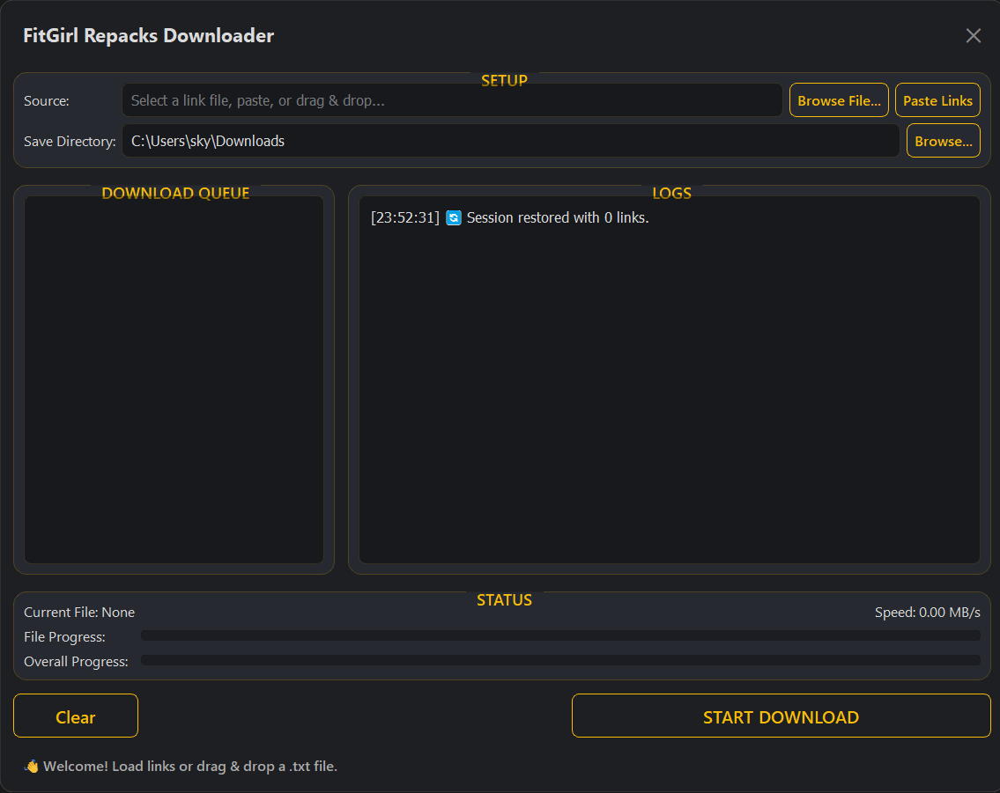

# FitGirl Repacks Downloader

A modern, multi-threaded GUI downloader designed to process and download files from FitGirl Repacks links efficiently. This utility is specifically built to handle the **"F**king Fast"** download links to maximize speed and reliability.



---

## ✨ Features

* **Modern, "Glassmorphism" UI:** A sleek, semi-transparent user interface that is easy on the eyes.
* **Multiple Input Methods:**
    * Load links from a `.txt` file.
    * Paste links directly from the clipboard.
    * Drag and drop a `.txt` file onto the window.
* **Intelligent Download Queue:**
    * A "to-do list" style queue shows the status of each link (Pending, Downloading, Completed, Failed).
    * Automatically skips already completed or failed files when restarting a session.
* **Session Persistence:** The application automatically saves your queue on exit and restores it on the next launch, so you never lose your progress.
* **Robust Download Controls:** Full control to Start, Pause/Resume, and Stop the entire download session.
* **Efficient Multi-threaded Downloading:** Utilizes chunked, multi-threaded downloading for large files to maximize speed. Falls back to a single-threaded download for smaller files or unsupported servers.
* **Helpful Feedback:**
    * Detailed, emoji-rich logging of the entire process.
    * Dual progress bars for individual file and overall session progress.
    * Real-time speed display.
    * Native desktop notifications on download completion.

---

## 🚀 Getting Started (For Users)

The easiest way to use the application is to download the pre-built executable.

1.  Go to the **[Releases](https://github.com/your-username/your-repo-name/releases)** page of this GitHub repository.
2.  Download the latest `FitgirlRepackDownloader.exe` file from the "Assets" section.
3.  Place the `.exe` file in any folder on your computer.
4.  Double-click to run. No installation is needed!

---

## 📋 How to Use

1.  **Load Links:**
    * **Browse:** Click "Browse File..." to select a `.txt` file.
    * **Paste:** Copy text containing links, then click "Paste Links".
    * **Drag & Drop:** Drag your `.txt` file directly onto the application window.
2.  **Set Save Directory:** The default is your system's "Downloads" folder. Click "Browse..." next to the "Save Directory" field to change it.
3.  **Start Downloading:** Click the **"START DOWNLOAD"** button.
4.  **Monitor:** Watch the progress in the queue, logs, and status panels.
5.  **Control:** Use the "Pause," "Resume," and "Stop" buttons as needed. Your session will be saved automatically if you close the application.

---

## 🛠️ Building from Source (For Developers)

If you prefer to run or build the application from the source code, follow these steps.

### 1. Prerequisites

* Python 3.8+
* Git

### 2. Setup

1.  **Clone the repository:**
    ```bash
    git clone [https://github.com/your-username/your-repo-name.git](https://github.com/your-username/your-repo-name.git)
    cd your-repo-name
    ```

2.  **Create a virtual environment:**
    ```bash
    python -m venv venv
    venv\Scripts\activate
    ```

3.  **Install dependencies:**
    ```bash
    pip install -r requirements.txt
    ```

4.  **Run the application:**
    ```bash
    python FitgirlRepackDownloader.py
    ```

### 3. Creating the Executable

To package the application into a single `.exe` file yourself, run the following command:

```bash
pip install pyinstaller

pyinstaller --onefile --windowed --name="FitgirlRepackDownloader" FitgirlRepackDownloader.py
